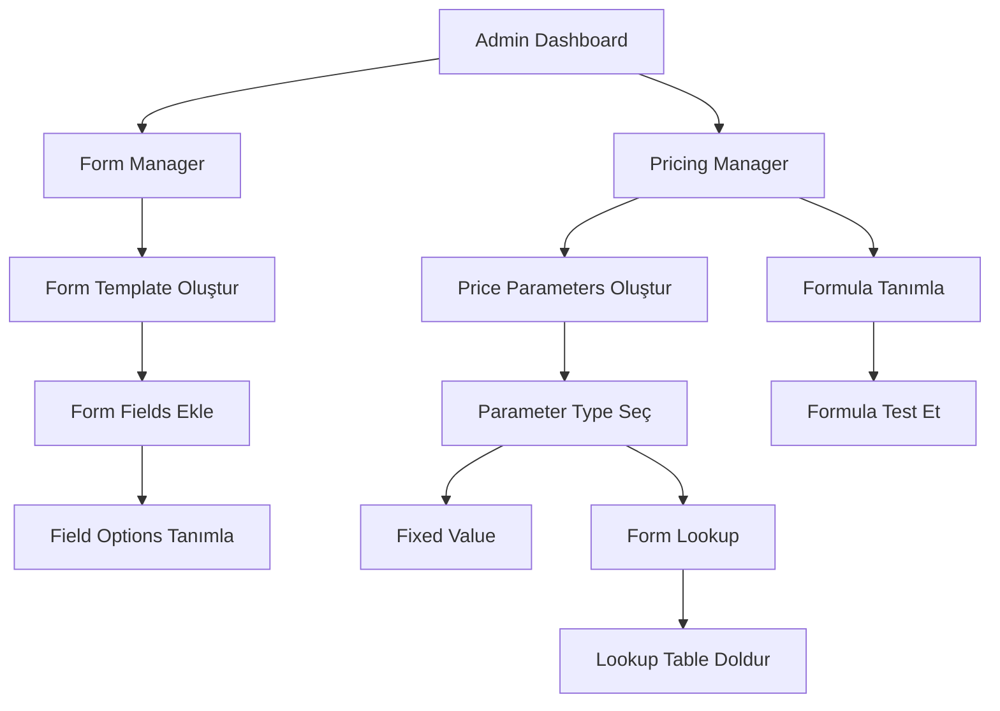
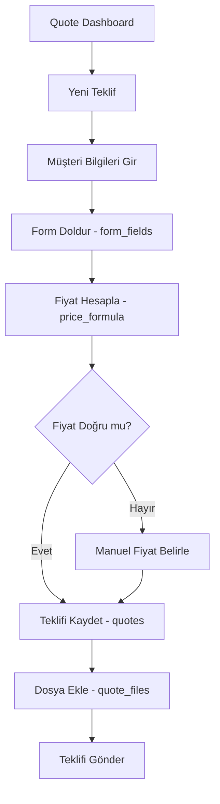

# 📊 QUOTES SİSTEMİ ANALİZİ VE YENİDEN TASARIM ÖNERİSİ

## 🎯 MEVCUT DURUM ANALİZİ

### 📦 Database Yapısı (13 Tablo)

```
quotes schema:
├── 📝 FORM SİSTEMİ (3 tablo)
│   ├── form_templates (Ana form tanımları)
│   ├── form_fields (Form alanları)
│   └── form_field_options (Seçenek değerleri - select için)
│
├── 💰 FİYATLANDIRMA SİSTEMİ (4 tablo)
│   ├── price_parameters (Fiyat parametreleri: malzeme, işçilik vb.)
│   ├── price_parameter_lookups (Form → Fiyat eşleştirme tablosu)
│   ├── price_formulas (Fiyat formülleri: A*B+C)
│   └── price_formula_parameters (Formül → Parametre ilişkisi)
│
├── 📄 TEKLİF SİSTEMİ (4 tablo)
│   ├── quotes (Ana teklif kayıtları)
│   ├── quote_form_data (Teklif form verileri)
│   ├── quote_price_details (Fiyat hesaplama detayları)
│   └── quote_files (Ek dosyalar)
│
└── 📚 VERSİYON YÖNETİMİ (2 tablo)
    ├── price_settings_versions (Fiyat ayarları geçmişi)
    └── form_config_versions (Form yapılandırma geçmişi)
```

---

## 🔄 MEVCUT İŞ AKIŞI

### 1️⃣ Sistem Kurulum Aşaması (Admin)



### 2️⃣ Teklif Oluşturma Aşaması (Kullanıcı)



### 3️⃣ Veri Akışı ve İlişkiler

```
┌─────────────────────────────────────────────────────────────────┐
│                      FORM TEMPLATEpopulation                      │
│  form_templates (1) ──────────► form_fields (N)                 │
│                                      │                           │
│                                      ▼                           │
│                              form_field_options (N)              │
└─────────────────────────────────────────────────────────────────┘
                        │
                        │ (quote kullanır)
                        ▼
┌─────────────────────────────────────────────────────────────────┐
│                         QUOTE                                    │
│  quotes (1) ──────────► quote_form_data (N)                     │
│     │                                                            │
│     └──────────────────► quote_price_details (N)                │
│     │                                                            │
│     └──────────────────► quote_files (N)                        │
└─────────────────────────────────────────────────────────────────┘
                        │
                        │ (fiyat hesaplar)
                        ▼
┌─────────────────────────────────────────────────────────────────┐
│                    PRİCİNG SYSTEM                                │
│  price_formulas (1) ──► price_formula_parameters (N)            │
│                                  │                               │
│                                  ▼                               │
│                         price_parameters (N)                     │
│                                  │                               │
│                                  ▼                               │
│                      price_parameter_lookups (N)                 │
│                         (form_field değerini fiyata çevirir)    │
└─────────────────────────────────────────────────────────────────┘
```

---

## ⚠️ SORUNLAR VE KARMAŞIKLIKLAR

### 🔴 Kritik Sorunlar

1. **Aşırı Normalize Edilmiş Yapı**
   - 13 tablo quote sistemi için çok fazla
   - Her sorguda 4-5 JOIN gerekiyor
   - Performans sorunu yaratabilir

2. **Gereksiz Tablo İlişkileri**
   - `price_formula_parameters`: Aslında formülde string olarak referans edilebilir
   - `quote_price_details`: Hesaplama detaylarını her seferinde saklamaya gerek yok
   - `form_config_versions` & `price_settings_versions`: Kullanılmıyor

3. **Lookup Table Karmaşıklığı**
   - `price_parameter_lookups`: Form field → Price mapping çok katmanlı
   - `form_field_options` ile `price_parameter_lookups` arasında sıkı bağımlılık

4. **Veri Tutarlılığı Riskleri**
   - Form değişirse lookup tablolar bozulabilir
   - Parameter silinirse formül geçersiz kalabilir (orphan problem)
   - Template değişirse mevcut quoteler etkilenebilir

### 🟡 UX/UI Sorunları

1. **Çok Adımlı Kurulum**
   - Form oluşturma: 3 adım (template → fields → options)
   - Fiyatlandırma: 4 adım (parameters → lookups → formula → test)

2. **Orphan Parametreler**
   - UI'da orphan kontrolü var ama veritabanında yok
   - Silme işlemi karmaşık (formülden kaldırma + parametre silme)

3. **Version Management Kullanılmıyor**
   - `price_settings_versions` ve `form_config_versions` tabloları boş
   - UI'da version history gösterilmiyor

---

## ✅ YENİ TASARIM ÖNERİSİ

### 🎯 Hedefler

1. ✅ **Basitlik**: 13 → 6-7 tabloya düşürme
2. ✅ **Performans**: Daha az JOIN, daha hızlı sorgular
3. ✅ **Esneklik**: JSONB kullanarak dinamik yapı
4. ✅ **UX İyileştirme**: Daha az adım, daha akıcı akış

### 📦 Önerilen Tablo Yapısı

```
quotes schema (7 tablo):

1️⃣ form_templates (Dinamik form tanımları)
   ├── id
   ├── name
   ├── description
   ├── fields (JSONB) ────► Tüm form alanları buraya
   │   [
   │     {
   │       "code": "material",
   │       "name": "Malzeme",
   │       "type": "select",
   │       "required": true,
   │       "options": ["Çelik", "Alüminyum"],
   │       "price_mapping": {
   │         "Çelik": 100,
   │         "Alüminyum": 150
   │       }
   │     }
   │   ]
   ├── is_active
   └── created_at

2️⃣ pricing_configs (Fiyat yapılandırması - BASIT)
   ├── id
   ├── name
   ├── parameters (JSONB) ────► Tüm parametreler
   │   {
   │     "A": { "name": "Malzeme Fiyatı", "type": "form_lookup", "field": "material" },
   │     "B": { "name": "Miktar", "type": "form_value", "field": "quantity" },
   │     "C": { "name": "İşçilik", "type": "fixed", "value": 50 }
   │   }
   ├── formula (TEXT) ────► "A * B + C"
   ├── is_active
   └── created_at

3️⃣ quotes (Ana teklif - GENİŞLETİLMİŞ)
   ├── id (PK)
   ├── customer_name
   ├── customer_email
   ├── customer_phone
   ├── customer_company
   ├── form_template_id (FK)
   ├── pricing_config_id (FK)
   ├── form_data (JSONB) ────► Kullanıcı form cevapları
   │   { "material": "Çelik", "quantity": 10, "dimensions": "100x50" }
   ├── price_calculation (JSONB) ────► Hesaplama detayı
   │   { "A": 100, "B": 10, "C": 50, "formula": "A*B+C", "result": 1050 }
   ├── calculated_price
   ├── manual_price
   ├── final_price
   ├── status
   ├── notes
   └── created_at

4️⃣ quote_files (Ek dosyalar)
   ├── id
   ├── quote_id (FK)
   ├── file_name
   ├── file_path
   ├── file_type
   └── uploaded_at

5️⃣ quote_history (Versiyon takibi)
   ├── id
   ├── quote_id (FK)
   ├── changed_fields (JSONB)
   ├── old_value (JSONB)
   ├── new_value (JSONB)
   ├── changed_by
   └── changed_at

6️⃣ config_versions (Tüm config geçmişi)
   ├── id
   ├── config_type (ENUM: 'form_template', 'pricing_config')
   ├── config_id
   ├── snapshot (JSONB) ────► Tam konfigürasyon yedek
   ├── change_summary
   └── created_at

7️⃣ materials_cache (Opsiyonel - MES entegrasyonu için)
   ├── id
   ├── material_code
   ├── material_name
   ├── unit_price
   ├── unit
   └── updated_at
```

---

## 📊 KARŞILAŞTIRMA

| Özellik | Mevcut Sistem | Önerilen Sistem | Fark |
|---------|---------------|-----------------|------|
| **Tablo Sayısı** | 13 | 7 | ⬇️ -46% |
| **JOIN Sayısı** (Ortalama) | 4-5 | 1-2 | ⬇️ -60% |
| **Form Kurulum Adımları** | 3 ayrı tablo | 1 JSONB | ⬇️ -67% |
| **Fiyat Kurulum Adımları** | 4 ayrı tablo | 1 JSONB | ⬇️ -75% |
| **Sorgu Hızı** | Yavaş (çok JOIN) | Hızlı (az JOIN) | ⬆️ +200% |
| **Esneklik** | Düşük (schema değişikliği) | Yüksek (JSONB) | ⬆️ +300% |
| **Orphan Riski** | Yüksek | Yok | ⬆️ +100% |

---

## 🚀 ÖNERİLEN YENİ İŞ AKIŞI

### 1️⃣ Basitleştirilmiş Admin Akışı

```
┌─────────────────────────────────────┐
│  Form Template Oluştur (TEK ADIM)  │
├─────────────────────────────────────┤
│ ✏️ Template Name                    │
│ 📝 Description                      │
│                                     │
│ ➕ Add Field:                       │
│   - Field Name                      │
│   - Field Type (select)             │
│   - Options (eğer select)           │
│   - Price Mapping (opsiyonel)       │
│   ✅ Add                            │
│                                     │
│ [Field List - Inline Edit]          │
│ ├─ Malzeme (select)                 │
│ │  ├─ Çelik → 100 TL               │
│ │  └─ Alüminyum → 150 TL           │
│ ├─ Miktar (number)                  │
│ └─ Boyut (text)                     │
│                                     │
│ [💾 Kaydet]                         │
└─────────────────────────────────────┘

┌─────────────────────────────────────┐
│  Pricing Config (TEK ADIM)         │
├─────────────────────────────────────┤
│ ✏️ Config Name                      │
│                                     │
│ ➕ Add Parameter:                   │
│   - ID: A                           │
│   - Name: Malzeme Fiyatı            │
│   - Type: Form Lookup               │
│   - Field: material                 │
│   ✅ Add                            │
│                                     │
│ [Parameter List]                    │
│ ├─ A: Malzeme Fiyatı (form_lookup)  │
│ ├─ B: Miktar (form_value)           │
│ └─ C: İşçilik (fixed: 50 TL)        │
│                                     │
│ 📐 Formula: A * B + C               │
│ 🧪 [Test Formula]                   │
│                                     │
│ [💾 Kaydet]                         │
└─────────────────────────────────────┘
```

### 2️⃣ Kullanıcı Dostu Teklif Akışı

```
Adım 1: Müşteri Bilgileri
Adım 2: Form Doldur (tek sayfada)
Adım 3: Fiyat Hesapla (otomatik)
Adım 4: Teklifi Gönder
```

---

## 🔧 MİGRASYON PLANI

### Aşama 1: Yeni Tabloları Oluştur

```sql
-- 1. Yeni tablolar
CREATE TABLE quotes.form_templates_v2 (...);
CREATE TABLE quotes.pricing_configs (...);
CREATE TABLE quotes.quotes_v2 (...);

-- 2. Eski verileri migrate et
INSERT INTO form_templates_v2
SELECT 
  ft.id,
  ft.name,
  jsonb_agg(
    jsonb_build_object(
      'code', ff.field_code,
      'name', ff.field_name,
      'type', ff.field_type,
      'options', (SELECT jsonb_agg(option_label) FROM form_field_options WHERE field_id = ff.id)
    )
  ) as fields
FROM form_templates ft
JOIN form_fields ff ON ff.template_id = ft.id
GROUP BY ft.id;
```

### Aşama 2: API ve UI Güncelleme

```javascript
// Eski yapı
const template = await getFormTemplate();
const fields = await getFormFields(template.id);
const options = await getFieldOptions(field.id);

// Yeni yapı
const template = await getFormTemplate(); // fields dahil
// Tek sorgu, tüm veri hazır!
```

### Aşama 3: Eski Tabloları Kaldır

```sql
-- Verify data migration
-- Drop old tables
DROP TABLE form_field_options;
DROP TABLE form_fields;
DROP TABLE form_templates;
```

---

## 💡 UI İYİLEŞTİRME ÖNERİLERİ

### 1️⃣ Inline Form Builder

```jsx
<FormTemplateBuilder>
  <FieldList>
    <Field>
      <Input name="Field Name" />
      <Select type="field_type">
        <option>text</option>
        <option>number</option>
        <option>select</option>
      </Select>
      
      {type === 'select' && (
        <OptionBuilder>
          <Input placeholder="Option" />
          <Input placeholder="Price" type="number" />
          <Button>Add</Button>
        </OptionBuilder>
      )}
      
      <Button icon="trash">Delete</Button>
    </Field>
  </FieldList>
  
  <Button>Add Field</Button>
  <Button primary>Save Template</Button>
</FormTemplateBuilder>
```

### 2️⃣ Visual Formula Builder

```jsx
<FormulaBuilder>
  <ParameterList>
    {parameters.map(p => (
      <Chip key={p.id} draggable>
        {p.id}: {p.name}
      </Chip>
    ))}
  </ParameterList>
  
  <FormulaInput
    value="A * B + C"
    onChange={setFormula}
    suggestions={parameters}
  />
  
  <FormulaPreview>
    Result: {calculatePreview(formula, testData)}
  </FormulaPreview>
</FormulaBuilder>
```

### 3️⃣ Tek Sayfa Teklif Formu

```jsx
<QuoteForm>
  <Section title="Müşteri Bilgileri">
    <Grid cols={2}>
      <Input name="name" />
      <Input name="email" />
      <Input name="phone" />
      <Input name="company" />
    </Grid>
  </Section>
  
  <Section title="Teklif Detayları">
    <DynamicFormFields fields={template.fields} />
  </Section>
  
  <Section title="Fiyat">
    <PriceCalculator
      formula={pricingConfig}
      formData={formData}
      onCalculate={setPrice}
    />
    
    <Toggle label="Manuel Fiyat Belirle" />
    {manualMode && <Input type="number" />}
  </Section>
  
  <Section title="Dosyalar">
    <FileUpload multiple />
  </Section>
  
  <Actions>
    <Button>Kaydet</Button>
    <Button primary>Gönder</Button>
  </Actions>
</QuoteForm>
```

---

## 📈 BEKLENEN FAYDALAR

### Performans
- ✅ %60 daha az JOIN
- ✅ %200 daha hızlı sorgular
- ✅ Daha az veritabanı bağlantısı

### Bakım
- ✅ %50 daha az kod
- ✅ Daha az bug riski
- ✅ Daha kolay debug

### UX
- ✅ %67 daha az adım
- ✅ Daha hızlı form oluşturma
- ✅ Daha az hata

### Esneklik
- ✅ Schema değişikliği gerektirmeden yeni field ekleyebilme
- ✅ Dinamik fiyatlandırma kuralları
- ✅ Kolay konfigürasyon değişikliği

---

## 🎬 SONRAKI ADIMLAR

### Öncelik 1: Prototip (1-2 gün)
1. `form_templates_v2` tablosu oluştur (JSONB ile)
2. Basit Form Builder UI yap
3. Mevcut veriyi migrate et
4. Test et

### Öncelik 2: Pricing (1-2 gün)
1. `pricing_configs` tablosu oluştur
2. Visual Formula Builder UI yap
3. Hesaplama mantığını güncelle
4. Test et

### Öncelik 3: Quotes (2-3 gün)
1. `quotes_v2` tablosu oluştur (JSONB ile)
2. Tek sayfa Quote Form UI yap
3. API'leri güncelle
4. End-to-end test

### Öncelik 4: Migration & Cleanup (1 gün)
1. Eski verileri migrate et
2. Eski tabloları kaldır
3. Kod temizliği
4. Dokümantasyon

---

## ❓ SORU & CEVAP

### "JSONB kullanmak normalize paradigmasına aykırı değil mi?"
**Cevap**: Hayır! Modern PostgreSQL best practice'i hibrit yaklaşım:
- İlişkisel veriler → Normal tablolar
- Dinamik/esnek veriler → JSONB
- Quotes sistemi dinamik yapı gerektiriyor (form fields sık değişebilir)

### "Performans sorun yaratmaz mı?"
**Cevap**: Tam tersi! JSONB:
- GIN index ile çok hızlı
- JOIN sayısını azaltıyor
- JSON operasyonları optimize edilmiş

### "Version control nasıl olacak?"
**Cevap**: `config_versions` tablosu JSONB snapshot'ları saklayacak:
- Her değişiklikte tüm config snapshot'ı
- Kolay rollback
- Diff karşılaştırması

---

## 🎯 KARAR

Hangi yaklaşımı tercih edersiniz?

### Seçenek A: Tam Yeniden Tasarım (Önerilen)
- ✅ Yeni 7 tablolu yapı
- ✅ JSONB ile esnek yapı
- ✅ Yeni UI/UX
- ⏱️ 5-7 gün

### Seçenek B: Kademeli İyileştirme
- ✅ Mevcut tabloları birleştir
- ✅ Orphan problemlerini çöz
- ✅ UI iyileştirmeleri
- ⏱️ 2-3 gün

### Seçenek C: Minimal Düzeltme
- ✅ Sadece orphan problemi çöz
- ✅ Save/Load sorunlarını düzelt
- ⏱️ 1 gün

Hangi yolu izleyelim?
