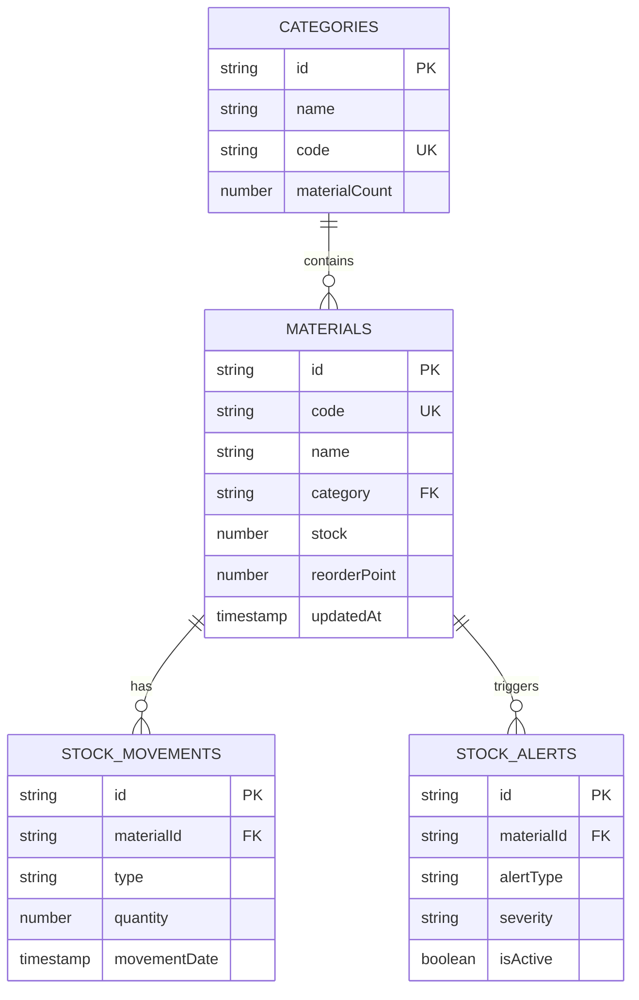

# Firebase Stok Yönetimi Sistemi

Bu dokümantasyon, Burkol Metal için geliştirilen Firebase tabanlı stok yönetimi sisteminin kurulum ve kullanım rehberidir.

## 📋 İçindekiler

- [Genel Bakış](#genel-bakış)
- [Sistem Mimarisi](#sistem-mimarisi)
- [Kurulum](#kurulum)
- [Veri Yapısı](#veri-yapısı)
- [API Kullanımı](#api-kullanımı)
- [React Hooks](#react-hooks)
- [Migration](#migration)
- [Güvenlik](#güvenlik)
- [Troubleshooting](#troubleshooting)

## 🎯 Genel Bakış

Bu sistem, malzeme stok yönetimi için kapsamlı bir Firebase entegrasyonu sağlar:

- **Real-time Stok Takibi**: Anlık stok durumu güncellemeleri
- **Otomatik Stok Uyarıları**: Düşük stok ve kritik seviye uyarıları
- **Hareket Geçmişi**: Tüm stok giriş/çıkışlarının detaylı logları
- **Kategori Yönetimi**: Malzeme kategorileri ve organizasyon
- **Validation**: Kapsamlı veri doğrulama ve hata kontrolü
- **Migration**: Mevcut datanın Firebase'e güvenli aktarımı

## 🏗️ Sistem Mimarisi

```
├── src/
│   ├── firebase-config.js          # Firebase yapılandırması
│   └── lib/
│       ├── firestore-schemas.js    # Veri şemaları ve validasyon
│       └── materials-service.js    # Firebase servis katmanı
├── hooks/
│   └── useFirebaseMaterials.js     # React hooks
├── scripts/
│   └── migrate-data.js             # Veri migration scripti
└── test-firebase-integration.sh    # Test ve doğrulama scripti
```

### Veri Modeli



## 🚀 Kurulum

### 1. Dosya Kontrolü

Öncelikle tüm dosyaların mevcut olduğunu kontrol edin:

```bash
./test-firebase-integration.sh quick
```

### 2. Firebase Proje Kurulumu

1. [Firebase Console](https://console.firebase.google.com)'da yeni proje oluşturun
2. Firestore Database'i etkinleştirin
3. Web app oluşturun ve config bilgilerini alın
4. `src/firebase-config.js` dosyasında config bilgilerini güncelleyin

### 3. Güvenlik Kuralları

Firestore Security Rules:

```javascript
rules_version = '2';
service cloud.firestore {
  match /databases/{database}/documents {
    // Materials collection
    match /materials/{materialId} {
      allow read, write: if request.auth != null;
    }
    
    // Categories collection
    match /categories/{categoryId} {
      allow read, write: if request.auth != null;
    }
    
    // Stock movements collection
    match /stockMovements/{movementId} {
      allow read, write: if request.auth != null;
    }
    
    // Stock alerts collection
    match /stockAlerts/{alertId} {
      allow read, write: if request.auth != null;
    }
  }
}
```

### 4. Veri Migration

```bash
# Dry run (test)
node scripts/migrate-data.js dry-run

# Gerçek migration
node scripts/migrate-data.js migrate

# Doğrulama
node scripts/migrate-data.js verify
```

## 📊 Veri Yapısı

### Materials Collection

```javascript
{
  id: "auto-generated-id",
  code: "ELK-001",                    // Unique material code
  name: "NYA Kablo 2.5mm²",          // Material name
  type: "Kablo",                     // Material type
  category: "cat-001",               // Reference to category
  unit: "Metre",                     // Unit of measurement
  stock: 850,                        // Current stock
  reorderPoint: 100,                 // Minimum stock level
  reserved: 0,                       // Reserved quantity
  available: 850,                    // Available = stock - reserved
  costPrice: 12.50,                  // Cost price
  sellPrice: 18.75,                  // Selling price
  supplier: "Türk Prysmian",         // Supplier name
  status: "Aktif",                   // Active, Inactive, etc.
  description: "Çok damarlı kablo",   // Description
  specifications: {                   // Technical specifications
    voltage: "450/750V",
    material: "Bakır"
  },
  tags: ["elektrik", "kablo"],       // Search tags
  isActive: true,                    // Active flag
  createdAt: timestamp,              // Creation date
  updatedAt: timestamp,              // Last update
  createdBy: "user-id",              // Creator
  updatedBy: "user-id",              // Last updater
  lastMovement: {                    // Last stock movement
    type: "in",
    quantity: 50,
    date: timestamp
  },
  alerts: {                          // Alert settings
    lowStockEnabled: true,
    expiryAlert: false
  }
}
```

### Stock Movements Collection

```javascript
{
  id: "auto-generated-id",
  materialId: "material-id",         // Reference to material
  materialCode: "ELK-001",           // Material code
  type: "in",                        // in/out
  subType: "purchase",               // purchase, sale, adjustment, etc.
  quantity: 50,                      // Movement quantity
  unit: "Metre",                     // Unit
  stockBefore: 100,                  // Stock before movement
  stockAfter: 150,                   // Stock after movement
  unitCost: 12.50,                   // Unit cost
  totalCost: 625.00,                 // Total cost
  currency: "TRY",                   // Currency
  reference: "PO-2024-001",          // Reference number
  referenceType: "purchase",         // Reference type
  supplierId: "supplier-id",         // Supplier reference
  warehouse: "Ana Depo",             // Warehouse
  location: "Raf-A1",                // Location in warehouse
  notes: "İlk stok girişi",          // Notes
  reason: "Satın alma",              // Reason for movement
  movementDate: timestamp,           // Movement date
  createdAt: timestamp,              // Record creation
  userId: "user-id",                 // User who made movement
  userName: "Admin User",            // User name
  approved: true,                    // Approval status
  approvedBy: "user-id",             // Approver
  approvedAt: timestamp              // Approval date
}
```

## 🔧 API Kullanımı

### MaterialsService

```javascript
import { MaterialsService } from '../lib/materials-service.js';

// Malzeme listesi
const materials = await MaterialsService.getMaterials({
  status: 'Aktif',
  category: 'cat-001'
});

// Yeni malzeme oluşturma
const newMaterial = await MaterialsService.createMaterial({
  code: 'ELK-004',
  name: 'LED Ampul 12W',
  category: 'cat-001',
  unit: 'Adet',
  stock: 100,
  reorderPoint: 20,
  costPrice: 8.90,
  sellPrice: 14.50
}, 'user-id');

// Stok güncelleme
await MaterialsService.updateStock(
  'material-id',
  50,                    // quantity (+ for in, - for out)
  'purchase',            // movement type
  {
    reference: 'PO-001',
    unitCost: 12.50,
    notes: 'Satın alma',
    userId: 'user-id'
  }
);

// Arama
const searchResults = await MaterialsService.searchMaterials('kablo', {
  category: 'cat-001'
});

// Dashboard istatistikleri
const stats = await MaterialsService.getDashboardStats();
```

### CategoriesService

```javascript
import { CategoriesService } from '../lib/materials-service.js';

// Kategori listesi
const categories = await CategoriesService.getCategories();

// Yeni kategori
const newCategory = await CategoriesService.createCategory({
  name: 'Yeni Kategori',
  code: 'YENI',
  description: 'Açıklama',
  color: '#FF6B6B',
  sortOrder: 10
});
```

## ⚛️ React Hooks

### useMaterials Hook

```javascript
import { useMaterials } from '../hooks/useFirebaseMaterials';

function MaterialsList() {
  const { 
    materials, 
    loading, 
    error, 
    pagination,
    loadMore,
    refresh 
  } = useMaterials(
    { status: 'Aktif' },           // filters
    { 
      limit: 20, 
      orderBy: 'updatedAt',
      realTime: true               // real-time updates
    }
  );

  if (loading) return <div>Yükleniyor...</div>;
  if (error) return <div>Hata: {error}</div>;

  return (
    <div>
      {materials.map(material => (
        <MaterialCard key={material.id} material={material} />
      ))}
      
      {pagination.hasMore && (
        <button onClick={loadMore}>Daha Fazla Yükle</button>
      )}
    </div>
  );
}
```

### useMaterialActions Hook

```javascript
import { useMaterialActions } from '../hooks/useFirebaseMaterials';

function MaterialForm() {
  const { createMaterial, updateMaterial, loading, error } = useMaterialActions();

  const handleSubmit = async (formData) => {
    try {
      await createMaterial(formData);
      // Success feedback
    } catch (err) {
      // Error handling
    }
  };

  return (
    <form onSubmit={handleSubmit}>
      {/* Form fields */}
      <button type="submit" disabled={loading}>
        {loading ? 'Kaydediliyor...' : 'Kaydet'}
      </button>
    </form>
  );
}
```

### useStockAlerts Hook

```javascript
import { useStockAlerts } from '../hooks/useFirebaseMaterials';

function AlertsPanel() {
  const { alerts, loading } = useStockAlerts({ 
    isActive: true 
  });

  return (
    <div>
      <h3>Stok Uyarıları ({alerts.length})</h3>
      {alerts.map(alert => (
        <AlertItem key={alert.id} alert={alert} />
      ))}
    </div>
  );
}
```

## 📦 Migration

### Dry Run (Test)

```bash
node scripts/migrate-data.js dry-run
```

Bu komut:
- Mevcut dummy datayı analiz eder
- Migration işlemini simüle eder
- Hataları rapor eder
- Hiçbir veri oluşturmaz

### Live Migration

```bash
node scripts/migrate-data.js migrate
```

Bu komut:
- Kategorileri oluşturur
- Malzemeleri oluşturur
- İlk stok hareketlerini kaydeder
- Stok uyarılarını kontrol eder

### Migration Raporu

```json
{
  "timestamp": "2024-01-15T10:30:00.000Z",
  "dryRun": false,
  "duration": "12.5 seconds",
  "summary": {
    "categories": { "success": 5, "failed": 0 },
    "materials": { "success": 15, "failed": 0 },
    "totalSuccess": 20,
    "totalFailed": 0
  }
}
```

## 🔒 Güvenlik

### Authentication

```javascript
import { auth } from '../firebase-config.js';
import { signInWithEmailAndPassword } from 'firebase/auth';

// Login
const userCredential = await signInWithEmailAndPassword(auth, email, password);
const user = userCredential.user;

// Check auth state
auth.onAuthStateChanged((user) => {
  if (user) {
    // User is signed in
  } else {
    // User is signed out
  }
});
```

### Security Rules Best Practices

1. **Authentication Required**: Tüm operasyonlar için authentication zorunlu
2. **User-Based Access**: Kullanıcı bazlı erişim kontrolü
3. **Data Validation**: Server-side veri doğrulama
4. **Rate Limiting**: API çağrıları için rate limiting

## 🔍 Troubleshooting

### Common Issues

#### 1. "Permission denied" hatası

```javascript
// Solution: Check Firebase Security Rules
// Ensure user is authenticated
// Verify user has required permissions
```

#### 2. "Module not found" hatası

```bash
# Solution: Check imports and file paths
npm install firebase
npm install @firebase/firestore
```

#### 3. Real-time updates çalışmıyor

```javascript
// Solution: Check subscription management
useEffect(() => {
  const unsubscribe = MaterialsService.subscribeToMaterials(callback);
  return () => unsubscribe(); // Cleanup
}, []);
```

#### 4. Migration hatası

```bash
# Solution: Check Firebase configuration
# Verify network connection
# Run dry-run first
node scripts/migrate-data.js dry-run
```

### Debug Mode

```javascript
// Enable debug mode
localStorage.setItem('firebase-debug', 'true');

// Check Firebase status
import { getFirebaseStatus } from '../firebase-config.js';
console.log(getFirebaseStatus());
```

### Performance Monitoring

```javascript
// Monitor query performance
const startTime = Date.now();
const materials = await MaterialsService.getMaterials();
const duration = Date.now() - startTime;
console.log(`Query took ${duration}ms`);
```

## 📈 Performance Tips

1. **Use Pagination**: Büyük listeler için pagination kullanın
2. **Optimize Queries**: Gereksiz field'ları sorgulamayın
3. **Cache Results**: Sık kullanılan verileri cache'leyin
4. **Batch Operations**: Toplu işlemler için batch kullanın
5. **Real-time Subscriptions**: Sadece gerekli yerlerde kullanın

## 🧪 Testing

### Unit Tests

```bash
# Run integration tests
./test-firebase-integration.sh

# Run specific tests
./test-firebase-integration.sh schema-only
./test-firebase-integration.sh migration-only
```

### Manual Testing

```javascript
// Test material creation
const testMaterial = {
  code: 'TEST-001',
  name: 'Test Material',
  category: 'cat-001',
  unit: 'Adet',
  stock: 100,
  reorderPoint: 10
};

const result = await MaterialsService.createMaterial(testMaterial, 'test-user');
console.log('Created:', result);
```

## 📚 API Reference

### MaterialsService Methods

| Method | Description | Parameters |
|--------|-------------|------------|
| `getMaterials()` | Get materials list | `filters`, `pagination` |
| `getMaterial()` | Get single material | `materialId` |
| `createMaterial()` | Create new material | `materialData`, `userId` |
| `updateMaterial()` | Update material | `materialId`, `updateData`, `userId` |
| `deleteMaterial()` | Delete material | `materialId`, `userId` |
| `updateStock()` | Update stock | `materialId`, `quantity`, `type`, `details` |
| `searchMaterials()` | Search materials | `searchTerm`, `filters` |
| `getStockMovements()` | Get stock movements | `materialId`, `filters` |
| `getStockAlerts()` | Get stock alerts | `filters` |
| `getDashboardStats()` | Get dashboard stats | - |

### Hook Reference

| Hook | Description | Returns |
|------|-------------|---------|
| `useMaterials()` | Materials list with real-time updates | `materials`, `loading`, `error`, `pagination` |
| `useMaterial()` | Single material | `material`, `loading`, `error` |
| `useMaterialActions()` | CRUD operations | `createMaterial`, `updateMaterial`, `deleteMaterial` |
| `useCategories()` | Categories list | `categories`, `loading`, `error` |
| `useStockAlerts()` | Stock alerts with real-time | `alerts`, `loading`, `error` |
| `useMaterialSearch()` | Search functionality | `searchResults`, `search`, `loading` |

## 🔄 Updates & Maintenance

### Regular Tasks

1. **Backup**: Firestore otomatik backup aktif
2. **Index Optimization**: Composite index'leri optimize edin
3. **Security Rules**: Düzenli güvenlik kuralları review
4. **Performance**: Query performansını izleyin
5. **Cost**: Firebase kullanım maliyetlerini takip edin

### Version Updates

```bash
# Update Firebase SDK
npm update firebase

# Test after updates
./test-firebase-integration.sh
```

---

## 📞 Support

Bu sistemle ilgili sorularınız için:

1. İlk olarak bu dokümantasyonu kontrol edin
2. [Troubleshooting](#troubleshooting) bölümüne bakın
3. Test scriptini çalıştırın: `./test-firebase-integration.sh quick`
4. Firebase Console'dan error log'larını kontrol edin

**Versiyon:** 1.0.0  
**Son Güncelleme:** 2024-01-15  
**Geliştirici:** GitHub Copilot